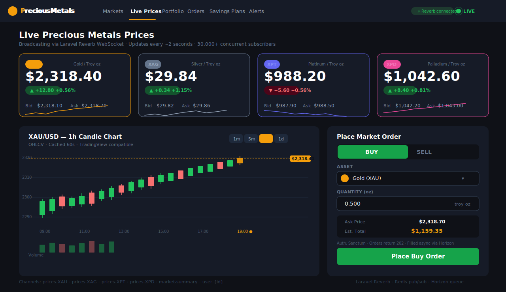
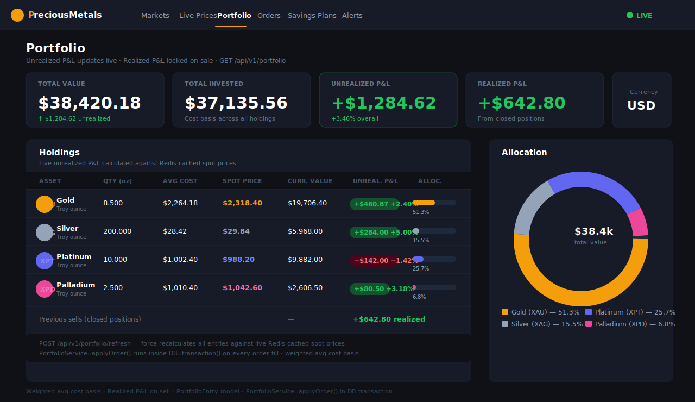
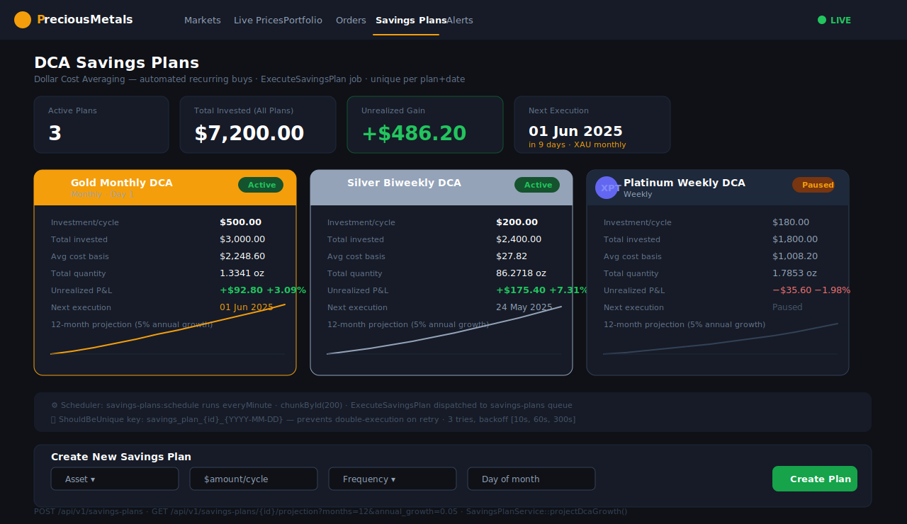
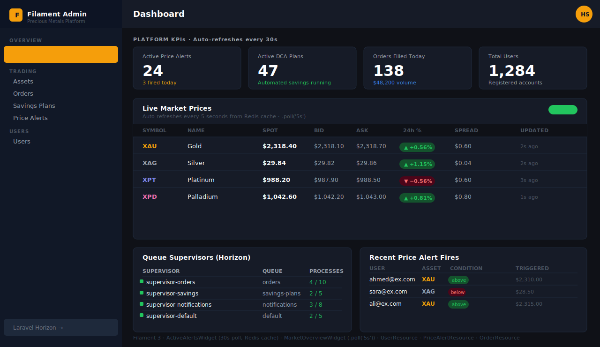

# Laravel Precious Metals Platform

> High-traffic Laravel platform for live precious metals trading — WebSocket price feeds to 30k+ concurrent users, Redis-backed queue workers, ElasticSearch asset search, price alert engine, portfolio P&L tracking, Filament 3 admin panel, and an event-driven DCA savings plan engine.

Built directly against Kettner's stack: **Laravel · Redis · WebSockets · ElasticSearch · Filament · Docker**.

---

## Screenshots

### Live Price Feed & Order Placement


### Portfolio P&L Dashboard


### DCA Savings Plans


### Filament Admin Panel


---

## Architecture

```
┌─────────────────────────────────────────────────────────────────────────┐
│                     Vue / Nuxt Frontend                                 │
│   Live Ticker · Order Form · DCA Chart · Portfolio Dashboard           │
└──────────────┬──────────────────────┬──────────────────────────────────┘
               │ REST /api/v1/*        │ WebSocket (Echo + Reverb)
┌──────────────▼──────────────────────▼──────────────────────────────────┐
│                       Laravel 11 Application                            │
│                                                                         │
│  ┌─────────────┐  ┌─────────────┐  ┌──────────────┐  ┌─────────────┐  │
│  │ AssetCtrl   │  │ OrderCtrl   │  │ SavingsPlan  │  │ PortfolioCtrl│  │
│  │ Redis 5s    │  │ 202 + queue │  │ DCA + chart  │  │ P&L summary  │  │
│  └─────────────┘  └─────────────┘  └──────────────┘  └─────────────┘  │
│                                                                         │
│  ┌─────────────┐  ┌─────────────┐  ┌──────────────┐  ┌─────────────┐  │
│  │ PriceAlertCtrl│ │ WatchlistCtrl│ │ SearchCtrl  │  │ Policies    │  │
│  │ CRUD + fire │  │ per-user    │  │ ES fuzziness │  │ ownership   │  │
│  └─────────────┘  └─────────────┘  └──────────────┘  └─────────────┘  │
└──────┬────────────────────┬─────────────────────────────────────────────┘
       │                    │
┌──────▼──────┐     ┌───────▼──────────────────────────────────────────────┐
│   Redis     │     │  Queue Workers — Horizon (4 named queues)            │
│  5s prices  │     │  ┌─────────────┐ ┌─────────────┐ ┌────────────────┐ │
│  60s candles│     │  │ ProcessOrder│ │ExecuteDCA   │ │CheckPriceAlerts│ │
│  30s stats  │     │  │ ShouldUniq  │ │unique/day   │ │everyMinute     │ │
│  queues     │     │  │ 3 retries   │ │fills+portf. │ │Redis price read│ │
└──────┬──────┘     │  └─────────────┘ └─────────────┘ └────────────────┘ │
       │            │  ┌─────────────┐ ┌──────────────────────────────────┐│
       │            │  │BroadcastMkt │ │  Notifications (mail + database)  ││
       │            │  │every 30s    │ │  OrderFulfilled · DCAExecuted     ││
       │            │  │gainers/losers│ │  PriceAlertTriggered             ││
       │            │  └─────────────┘ └──────────────────────────────────┘│
       │            └──────────────────────────────────────────────────────┘
       │
┌──────▼───────────────────────────────────────────────────────────────────┐
│  Laravel Reverb (WebSocket Server)                                       │
│  prices.{symbol}   — public   — live tick data (30k+ subscribers)        │
│  market-summary    — public   — gainers/losers every 30s                 │
│  live-event        — presence — viewer count                             │
│  user.{id}         — private  — fills, DCA executions, price alert fires │
└──────────────────────────────────────────────────────────────────────────┘
       │
┌──────▼─────────────────┐     ┌─────────────────────────────────────────┐
│  ElasticSearch 8       │     │  MySQL 8                                │
│  symbol^3 / name^2     │     │  Composite indexes, soft deletes        │
│  fuzzy + currency filter│     │  OHLCV upsert unique constraint        │
└────────────────────────┘     └─────────────────────────────────────────┘
```

---

## Key Technical Highlights

### 1. Real-Time Price Broadcasting at Scale
`app/Events/PriceUpdated.php` — `app/Services/PriceService.php`

- **Laravel Reverb** broadcasts live XAU/XAG/XPT/XPD ticks to public channels
- `broadcastWhen()` gate suppresses ticks with < 0.001% movement — cuts queue noise by ~80%
- Presence channel (`live-event`) carries viewer count for the live page
- Payload trimmed to 7 fields to minimize per-message bytes at 30k scale
- `MarketSummaryUpdated` broadcasts overall gainers/losers/top-mover every 30 seconds

### 2. Event-Driven Order Processing
`app/Jobs/ProcessOrder.php` — `app/Services/OrderService.php`

- Returns **202 Accepted** immediately; fill happens in the dedicated `orders` Horizon queue
- `ShouldBeUnique` on order ID prevents double-fill on retry
- `DB::transaction()` wraps price re-fetch + fill + portfolio apply atomically — no stale fill prices
- Retry: 3 attempts, backoff `[5s, 30s, 120s]`
- On fill: broadcasts `OrderFulfilled` to private channel **and** sends a mail + database notification

### 3. Portfolio Tracking with Real P&L
`app/Services/PortfolioService.php` — `app/Models/PortfolioEntry.php`

- Weighted average cost basis recalculated on every buy
- Realized P&L tracked on sell: `(sale_price − cost_basis) × qty` — stored per entry
- `GET /api/v1/portfolio` returns live unrealized P&L using current spot prices, allocation %, total cost vs total value
- `POST /api/v1/portfolio/refresh` force-recalculates all entries against live prices

### 4. Price Alert Engine
`app/Jobs/CheckPriceAlerts.php` — `app/Events/PriceAlertFired.php`

- Users set `above` / `below` threshold alerts via `POST /api/v1/price-alerts`
- `CheckPriceAlerts` runs every minute (`ShouldBeUnique`, 55s lock) — reads price from Redis 5s cache for accuracy
- On trigger: marks alert inactive, sends `PriceAlertTriggered` notification (mail + database), broadcasts `price_alert.fired` to private WebSocket channel
- `lazyById(100)` chunking avoids full table scans when many alerts exist

### 5. DCA Savings Plan Engine
`app/Services/SavingsPlanService.php` — `app/Jobs/ExecuteSavingsPlan.php`

- Scheduler runs `savings-plans:schedule` every minute with `chunkById(200)`
- Unique key `savings_plan_{id}_{date}` prevents double-execution across restarts
- `projectDcaGrowth(months, annualGrowth)` models future value using compound monthly growth
- `addMonthNoOverflow()` prevents February overflow (day 31 → day 28)
- On execution: sends `SavingsPlanExecuted` notification showing avg cost basis, total invested, next execution date

### 6. ElasticSearch Asset Search
`app/Services/AssetSearchService.php` — `app/Http/Controllers/Api/SearchController.php`

- `GET /api/v1/search/assets?q=gold&currency=USD` — fuzzy multi-field search
- Field boost: `symbol^3 > name^2 > unit > currency` — "XAU" always beats "gold" for exact matches
- `fuzziness: AUTO` handles typos ("platnum" → "platinum")
- ES index kept in sync: `indexAsset()` on create, `updatePrice()` on tick with silent failure (non-critical path)
- `createIndex()` checks existence before creating — safe to call on every deploy

### 7. Redis Caching Strategy
`app/Services/PriceService.php` — `app/Http/Controllers/Api/AssetController.php`

| Key pattern | TTL | Purpose |
|---|---|---|
| `price:{symbol}` | 5s | Latest tick for alert checks + API responses |
| `assets:active` | 5s | Full asset list (cuts ~95% DB load on burst) |
| `candles:{id}:{res}:{from}:{to}` | 60s | OHLCV chart data |
| `daily_open:{id}` | 3600s | Daily open for change% calculation |
| `admin:order_stats` | 30s | Filament stats widget |
| `admin:platform_stats` | 30s | Active alerts, DCA plans, volume |

### 8. Filament 3 Admin Panel
`app/Filament/Resources/` — `app/Filament/Widgets/`

- `AssetResource` — live price table, `.poll('5s')`, color-coded change% badges
- `OrderResource` — full order book + `OrderStatsOverview` widget (filled, volume, pending, failed)
- `SavingsPlanResource` — DCA plan management with next-execution dates
- `UserResource` — user management with counts: orders, DCA plans, active alerts
- `PriceAlertResource` — all alerts across users, filterable by active/triggered/condition
- `MarketOverviewWidget` — live market table, 5s poll, full-width
- `ActiveAlertsWidget` — platform KPIs: active alerts, DCA plans, orders today, volume today

### 9. Horizon Configuration
`config/horizon.php`

Four named supervisors mapped to named queues:

| Supervisor | Queue | Max Processes (prod) | Timeout |
|---|---|---|---|
| `supervisor-orders` | `orders` | 10 | 60s |
| `supervisor-savings` | `savings-plans` | 5 | 90s |
| `supervisor-notifications` | `notifications` | 8 | 60s |
| `supervisor-default` | `default` | 5 | 60s |

---

## API Reference

### Public

| Method | Endpoint | Description |
|--------|----------|-------------|
| `GET` | `/api/v1/assets` | List active assets (cached 5s) |
| `GET` | `/api/v1/assets/{symbol}` | Single asset with live prices |
| `GET` | `/api/v1/assets/{symbol}/candles` | OHLCV data (`?resolution=1m&from=&to=`) |
| `GET` | `/api/v1/search/assets` | ElasticSearch (`?q=gold&currency=USD`) |

### Authenticated (Sanctum)

| Method | Endpoint | Description |
|--------|----------|-------------|
| `POST` | `/api/v1/orders` | Place market order → 202 + queued |
| `GET` | `/api/v1/orders` | Order history (cursor pagination) |
| `DELETE` | `/api/v1/orders/{id}` | Cancel pending order |
| `GET` | `/api/v1/portfolio` | Holdings + live P&L |
| `POST` | `/api/v1/portfolio/refresh` | Force-refresh against live prices |
| `GET` | `/api/v1/savings-plans` | List DCA plans |
| `POST` | `/api/v1/savings-plans` | Create DCA plan |
| `GET` | `/api/v1/savings-plans/{id}/projection` | DCA growth projection chart |
| `DELETE` | `/api/v1/savings-plans/{id}` | Cancel plan |
| `GET` | `/api/v1/price-alerts` | List user's alerts |
| `POST` | `/api/v1/price-alerts` | Create alert (`above`/`below` + target) |
| `DELETE` | `/api/v1/price-alerts/{id}` | Delete alert |
| `GET` | `/api/v1/watchlist` | User's watchlist with live prices |
| `POST` | `/api/v1/watchlist` | Add asset to watchlist |
| `DELETE` | `/api/v1/watchlist/{asset}` | Remove from watchlist |

---

## Quick Start

```bash
# 1. Clone
git clone https://github.com/Hafiz-M-Subhan/laravel-precious-metals-platform.git
cd laravel-precious-metals-platform

# 2. Environment
cp .env.example .env
php artisan key:generate

# 3. Spin up (MySQL, Redis, Elasticsearch, Reverb, Horizon, price simulator)
docker compose up -d

# 4. Migrate + seed
php artisan migrate --seed

# 5. Horizon queue dashboard at /horizon
php artisan horizon

# 6. WebSocket server
php artisan reverb:start

# 7. Simulate live price feed (dev)
php artisan prices:simulate --interval=2 --volatility=0.002
```

Open `http://localhost:8000/admin` for the Filament panel.

---

## Running Tests

```bash
php artisan test                                         # all tests
php artisan test tests/Unit/Services/PriceServiceTest   # unit only
php artisan test tests/Feature/Api/                     # feature only
php artisan test --coverage                             # with coverage
```

---

## Tech Stack

| Layer | Technology |
|---|---|
| Framework | Laravel 11, PHP 8.2 |
| WebSocket | Laravel Reverb + Laravel Echo |
| Queue + Dashboard | Redis + Laravel Horizon (4 named queues) |
| Cache | Redis (6 TTL tiers) |
| Search | ElasticSearch 8 (`elastic/elasticsearch-php`) |
| Admin | Filament 3 (resources, widgets, live poll) |
| Database | MySQL 8 (covering indexes, soft deletes, OHLCV upsert) |
| Auth | Laravel Sanctum (SPA + API tokens) |
| Notifications | Mail + database (queued) |
| Infrastructure | Docker Compose, GitHub Actions CI |

---

## Project Structure

```
app/
├── Console/
│   ├── Kernel.php                     # Scheduler: DCA, alerts, market summary
│   └── Commands/
│       ├── SimulatePriceFeed.php      # Dev GBM price simulator
│       └── ScheduleSavingsPlans.php   # DCA cron dispatcher
├── Events/
│   ├── PriceUpdated.php               # prices.{symbol} — 30k subscribers
│   ├── OrderFulfilled.php             # user.{id} — private
│   ├── SavingsPlanExecuted.php        # user.{id} — private
│   ├── PriceAlertFired.php            # user.{id} — private
│   └── MarketSummaryUpdated.php       # market-summary — public
├── Filament/Resources/
│   ├── AssetResource.php              # 5s poll, change% badges
│   ├── OrderResource.php              # Order book + stats widget
│   ├── SavingsPlanResource.php        # DCA management
│   ├── UserResource.php               # User management + counts
│   └── PriceAlertResource.php         # All alerts, filterable
├── Filament/Widgets/
│   ├── OrderStatsOverview.php         # Today's fills, volume, pending, failed
│   ├── MarketOverviewWidget.php       # Live market table (5s poll, full-width)
│   └── ActiveAlertsWidget.php         # Platform KPIs (30s poll)
├── Http/Controllers/Api/
│   ├── AssetController.php            # GET /assets, /candles
│   ├── OrderController.php            # POST /orders → 202
│   ├── SavingsPlanController.php      # DCA CRUD + /projection
│   ├── PortfolioController.php        # Portfolio + P&L
│   ├── PriceAlertController.php       # Alert CRUD
│   ├── WatchlistController.php        # Watchlist CRUD
│   └── SearchController.php           # ES search
├── Http/Resources/
│   ├── AssetResource.php
│   ├── OrderResource.php
│   ├── SavingsPlanResource.php
│   ├── PortfolioResource.php
│   ├── PriceAlertResource.php
│   └── WatchlistResource.php
├── Jobs/
│   ├── ProcessOrder.php               # ShouldBeUnique, 3 retries, atomic fill
│   ├── ExecuteSavingsPlan.php         # Unique per plan+date, DCA buy
│   ├── CheckPriceAlerts.php           # Every minute, Redis price read
│   └── BroadcastMarketSummary.php     # Every 30s, gainers/losers
├── Models/
│   ├── Asset.php                      # XAU, XAG, XPT, XPD
│   ├── Order.php                      # buy/sell, statuses
│   ├── PriceHistory.php               # OHLCV candles
│   ├── Portfolio.php                  # totals + P&L
│   ├── PortfolioEntry.php             # per-asset: qty, cost basis, P&L
│   ├── SavingsPlan.php                # DCA plans
│   ├── PriceAlert.php                 # above/below threshold alerts
│   └── Watchlist.php                  # user watchlisted assets
├── Notifications/
│   ├── OrderFulfilled.php             # mail + database
│   ├── SavingsPlanExecuted.php        # mail + database
│   └── PriceAlertTriggered.php        # mail + database
├── Policies/
│   ├── OrderPolicy.php                # ownership + isPending guard
│   ├── SavingsPlanPolicy.php          # ownership + not-cancelled guard
│   └── PriceAlertPolicy.php           # ownership guard
└── Services/
    ├── PriceService.php               # Tick ingestion, OHLCV upsert, Redis cache
    ├── OrderService.php               # placeMarket(), fill() in transaction
    ├── SavingsPlanService.php         # execute(), projectDcaGrowth(), nextDate()
    ├── PortfolioService.php           # applyOrder(), P&L, refreshPortfolio()
    └── AssetSearchService.php         # ES index, search, updatePrice()
```

---

## License

MIT
